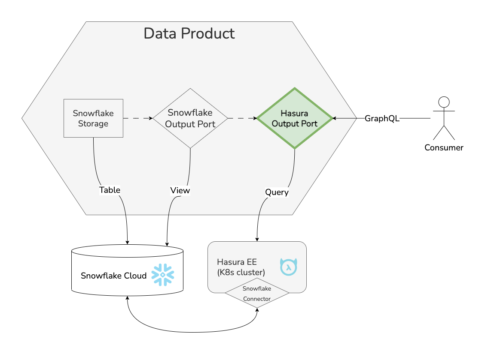

 

    

 

Designed by [Agile Lab](https://www.agilelab.it/), Witboost is a versatile platform that addresses a wide range of sophisticated data engineering challenges. It enables businesses to discover, enhance, and productize their data, fostering the creation of automated data platforms that adhere to the highest standards of data governance. Want to know more about Witboost? Check it out [here](https://www.agilelab.it/witboost) or [contact us!](https://www.agilelab.it/contacts)

This repository is part of our [Starter Kit](https://github.com/agile-lab-dev/witboost-starter-kit) meant to showcase Witboost's integration capabilities and provide a "batteries-included" product.

# Hasura Output Port Template

- [Overview](#overview)
- [Usage](#usage)

## Overview

Use this template to create an Output Port based on a Hasura Enterprise instance. It enables consumers to access your Data Product's data using GraphQL queries. The underlying data is provided by another Output Port; right now only Snowflake Output Ports are supported.

Refer to the [Witboost Starter Kit repository](https://github.com/agile-lab-dev/witboost-starter-kit) for information on the Specific Provisioner that can be used to deploy components created with this template.

### What's a Template?

A Template is a tool that helps create components inside a Data Mesh. Templates help establish a standard across the organization. This standard leads to easier understanding, management and maintenance of components. Templates provide a predefined structure so that developers don't have to start from scratch each time, which leads to faster development and allows them to focus on other aspects, such as testing and business logic.

For more information, please refer to the [official documentation](https://docs.witboost.agilelab.it/docs/p1_user/p6_advanced/p6_1_templates/#getting-started).

### What's an Output Port?

An Output Port refers to the interface that a Data Product uses to provide data to other components or systems within the organization. The methods of data sharing can range from APIs to file exports and database links.

## Hasura

[Hasura](https://hasura.io/) is an open-source platform that provides a unified API layer over your data sources. It can be used to expose data from a variety of sources, including relational databases, NoSQL databases, and cloud storage.
It provides a number of benefits, including:
- Ease of use: Hasura is easy to use, even for non-technical users. It can be deployed in minutes, and it does not require any code changes to your data sources.
- Flexibility: Hasura can be used to expose data from a variety of sources. It also supports a variety of data access patterns, such as CRUD, GraphQL, and SQL.
- Security: Hasura provides a number of security features, such as role-based access control (RBAC) and data encryption.
- Scalability: Hasura can be scaled easily to meet the needs of your applications. It can also be deployed in a variety of environments, including on-premises, in the cloud, and in hybrid deployments.

Hasura's GraphQL API makes it easy to consume data from your data products. GraphQL is a powerful query language that allows you to specify exactly the data that you need. This makes it easy to build applications that only use the data that they need, which can improve performance and scalability.

Learn more about it on the [official website](https://hasura.io/docs/latest/index/).

## Usage

To get information on how to use this template, refer to this [document](./docs/index.md).

## License

This project is available under the [Apache License, Version 2.0](https://opensource.org/licenses/Apache-2.0); see [LICENSE](LICENSE) for full details.

## About us

 

    

 

Agile Lab creates value for its Clients in data-intensive environments through customizable solutions to establish performance driven processes, sustainable architectures, and automated platforms driven by data governance best practices.

Since 2014 we have implemented 100+ successful Elite Data Engineering initiatives and used that experience to create Witboost: a technology-agnostic, modular platform, that empowers modern enterprises to discover, elevate and productize their data both in traditional environments and on fully compliant Data mesh architectures.

[Contact us](https://www.agilelab.it/contacts) or follow us on:
- [LinkedIn](https://www.linkedin.com/company/agile-lab/)
- [Instagram](https://www.instagram.com/agilelab_official/)
- [YouTube](https://www.youtube.com/channel/UCTWdhr7_4JmZIpZFhMdLzAA)
- [Twitter](https://twitter.com/agile__lab)
